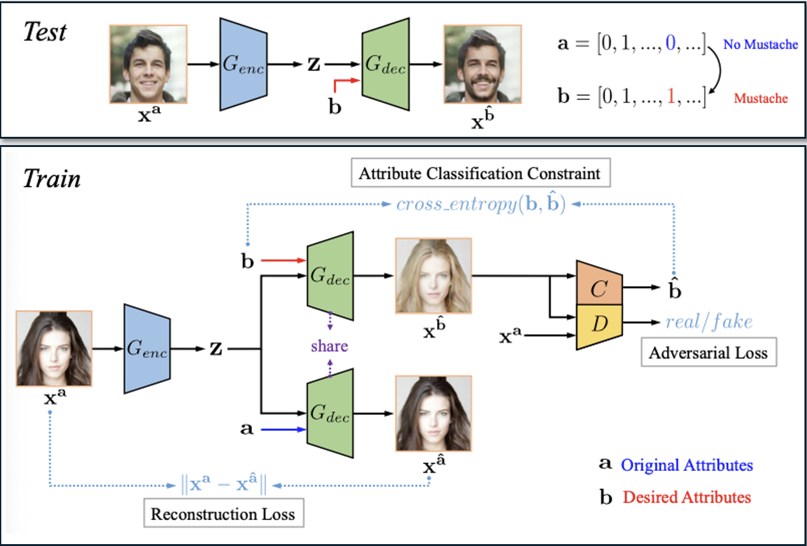

# AttGAN: Facial Attribute Editing by Only Changing What You Want
This project is an implementation of [AttGAN: Facial Attribute Editing by Only Changing What You Want](https://arxiv.org/abs/1711.10678), a deep learning model for facial attribute editing. 


## Introduction
Facial attribute editing aims to edit attributes of interest (e.g. hair color, accessories, mouth) on a face image while preserving the identity of the person. It has applications in various industries, like entertainment and media generation (e.g. deepfakes, face manipulation in films or photo shooting), but also plastic surgery or security. 
With the lack of suitable labeled datasets, current approaches rely on generative models like Generative Adversarial Networks (GANs) and encoder-decoder architectures aiming at decoding latent representation of a given face conditioned on the desired attributes. Some of them attempt to build attribute-independent latent representations. However, these techniques often suffer from loss of facial details, unintended attribute changes due to correlations in the dataset, and the need for multiple models to handle different attribute edits.

[AttGAN](https://arxiv.org/abs/1711.10678) (Attribute Generative Adversarial Network) introduces an improved framework, leveraging an encoder-decoder structure combined with attribute classification constraints, reconstruction learning and adversarial learning at training. It results in more realistic facial transformations, better retention of details and a more flexible model that can handle multiple attributes simultaneously with a single implementation.

## Model Architecture

### Principles

AttGAN is built upon an encoder-decoder architecture:


The model is combined with additional components used during training to learn how to generate realistic and precise edits: 
1) Attribute Classification Constraint: A pre-trained Attribute Classifier is used to check whether the attributes in the output image match the desired ones.
2) Reconstruction Learning: Aims at preserving the attribute-excluding details. If an image is passed without modification, it should be perfectly reconstructed.
3) Adversarial Learning: Employed for visually realistic generation. A Wasserstein GAN with Gradient Penalty (WGAN-GP) ensures that the generated images look realistic and indistinguishable from real pictures.

### Implementation


Our AttGAN implementation presents the following default architecture, consisting of :
- 5 convolutional layers for the encoder.
- 5 transposed convolutional layers	for the decoder to reconstruct the modified image.
- A discriminator based on a CNN with a dual output: one branch for real/fake classification, another branch for multi-label attribute prediction.

Attribute injection is performed by concatenating the attribute vector with the encoded feature map before decoding. The attributes, represented as a binary vector (e.g., “smiling” = 1, “beard” = 0), are first reshaped and broadcasted to match the spatial dimensions of the feature map. This injection can occur once at the bottleneck or at multiple decoder layers, by playing on the "inject_layers" parameter.

The model also presents shortcut connections, inspired by U-Net to help preserve fine details during image reconstruction. They link encoder and decoder layers, allowing high-level features from the input image to be skipped over the latent space and reused in the decoder. The number of skipping connections can be modified with the "shortcut_layers" parameters.

## Requirements

Type the following command to install the required modules:
```bash
pip install -r requirements.txt
```

If you want to retrain the model, you'll also need to download the CelebA Dataset. You can modify the path for the dataset in the `download_data.py` file, and then execute the command:
```bash
python3 download_data.py
```
Images will be placed in `./data/img_align_celeba/*.jpg`, and attribute labels in `./data/list_attr_celeba.csv`

